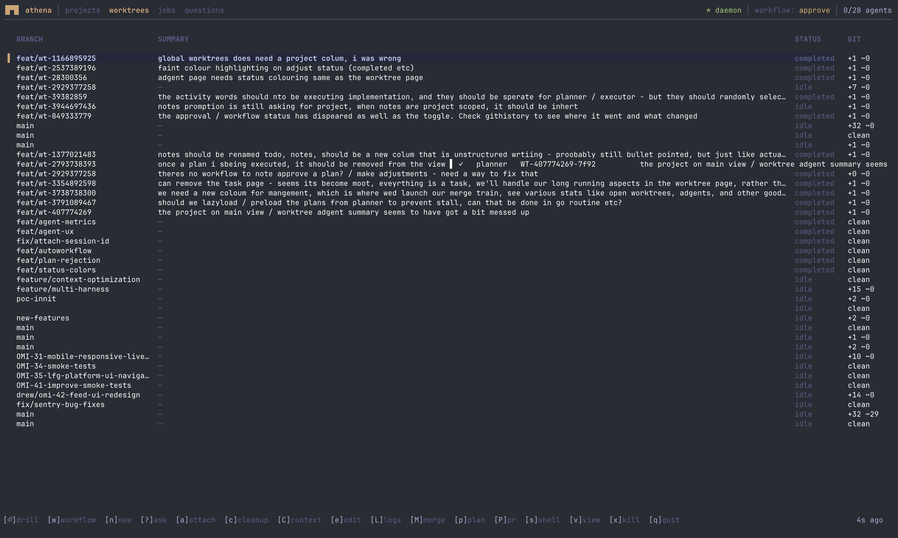

# Athena

**The Intelligence Orchestrator and Bloomberg Terminal of Engineering**

The future is not Hephaestus—the IDE fork of building. It’s Athena: the Bloomberg terminal of engineering—one command-and-control platform that condenses everything (project management, CI/CD, IDE context, agent monitoring, ops views, integrations) into a single terminal, fanning out to external APIs but converging back into one unified interface.

Athena at its core orchestrates AI coding agents (Claude Code, Codex, and whatever comes next) for maximum developer productivity. It's not another harness - it's the control plane that coordinates the racing products in this space while keeping *your* data yours.



More UI views live in [docs/screenshots.md](docs/screenshots.md).

## Philosophy

**Sell shovels, not gold.** The harnesses (Claude Code, Codex) are great and improving fast. Athena doesn't compete - it orchestrates across them, letting you leverage whichever is best for each task.

**Your data, your context.** Every prompt, response, tool call, and decision flows through Athena's data plane and persists in your storage. Not locked in a vendor's session history. This is the foundation for context systems, RAG, memory, and whatever comes next.

## Quick Start

```bash
make install    # Install athena, athenad, wt
athenad &       # Start daemon
athena          # Launch TUI
```

See [docs/development.md](docs/development.md) for building from source.

## License

MIT
