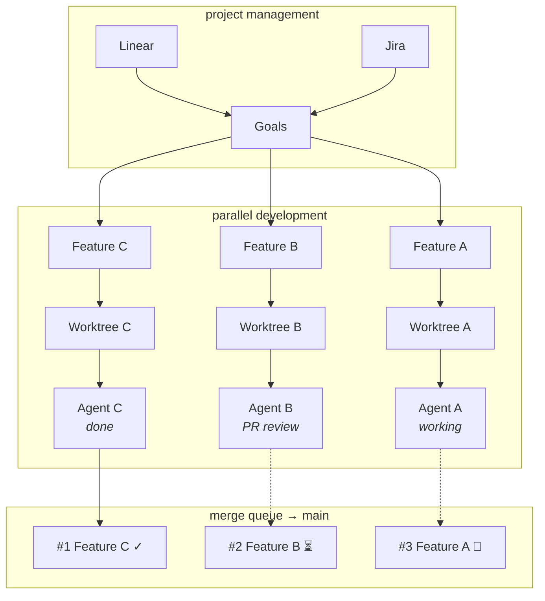
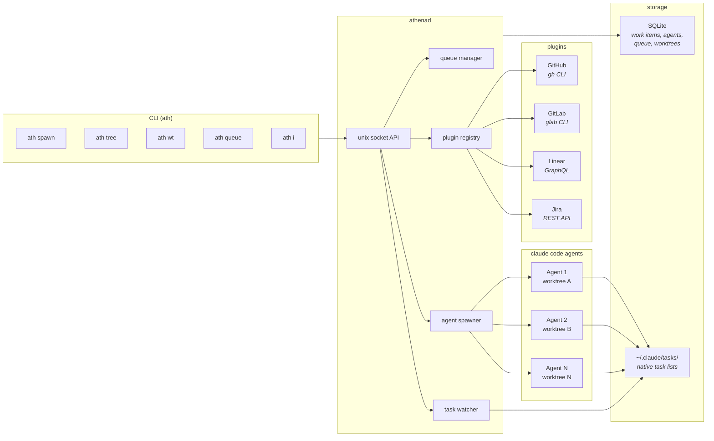

# athena

bloomberg terminal for engineering.

> [!WARNING]
> pre-1.0. active development. things will break.

one terminal. tickets, agents, worktrees, task lists. no context switching.

athena doesn't reinvent orchestration. claude code already has teams, task lists, and MCP. athena provides the project management layer (goals, features, merge queue) and infrastructure (worktrees, plugins) around them.

## the flow

```
idea → goal → feature → worktree → agent → tasks → PR
```

```bash
ath g new "Auth system"              # create a goal
ath f new wi-a3f8 "OAuth login"      # feature under that goal
ath spawn -f wi-a3f8.1               # worktree + agent + task list, one command
```

or import directly from your PM tool:

```bash
ath spawn ENG-123                    # epic → goal + features
ath spawn ENG-456                    # story → feature under parent goal
```

agent spins up in its own worktree. watch from another tab:

```bash
ath tree                             # see the whole hierarchy
ath tree wi-a3f8                     # zoom into one goal
ath wt                               # worktree status
```

## getting started

```bash
ath enable
```

that's it. athena hooks into claude code's lifecycle — every session now gets tracked as a work item, features auto-join the merge queue, and PR status updates flow back automatically. you don't need to change how you use claude. just `ath enable` once per project and athena starts managing the plumbing.

want the full orchestration? keep reading. just want tracking? you're done.

## spawn

the core command. creates a worktree, sets up the task list, launches claude code.

```bash
ath spawn -f <feature-id>            # primary flow - worktree + agent
ath spawn -f <feature-id> --headless # fire-and-forget, runs in background
ath spawn                            # interactive claude in current dir
ath spawn ENG-123                    # ticket ID → smart routing → spawn
```

the agent gets your goal context, feature description, and available commands injected into its system prompt. its task list maps 1:1 to your feature work item.

## work items

```
Goal     □  Auth system               ← strategic objective
  Feature  ◇  OAuth login             ← worktree + agent + PR
    Task     ○  Add token refresh     ← claude code native task
    Task     ○  Write tests           ← claude code native task
  Feature  ◇  Session management
```

goals are strategic. features are PR-sized. tasks are claude code's own task list - you see exactly what the agent sees.

## pm integration

athena maps your PM hierarchy into work items automatically:

| PM Tool | Source | Athena |
|---------|--------|--------|
| Jira | Epic | Goal |
| Jira | Story / Task / Bug | Feature |
| Linear | Project | Goal |
| Linear | Issue | Feature |
| Linear | Sub-issue | Task |

`ath spawn PROJ-100` on a Jira Epic creates a Goal with a Feature for each child Story. `ath spawn ENG-456` on a Story creates a Feature and auto-links the parent Epic as a Goal.

## merge queue

parallel features that merge in order. new work branches from queue head.

```bash
ath queue                            # show queue status
ath queue add                        # add current worktree
ath queue head                       # where new features should branch from
ath queue bump                       # refresh after edits, reconcile dependents
ath queue rm                         # remove from queue
```

## plugins

```bash
ath plugin                           # list all
ath plugin enable github             # GitHub PRs, CI/CD via gh CLI
ath plugin enable linear             # Linear issues via GraphQL API
ath plugin enable jira               # Jira issues via REST API
ath plugin enable gitlab             # GitLab MRs, CI/CD via glab CLI
```

## quick reference

```bash
ath enable             # install lifecycle hooks into claude code
ath disable            # remove hooks
ath                    # status overview
ath g new "subject"    # create goal
ath f new <goal> "x"   # create feature under goal
ath spawn -f <feat>    # spawn agent on feature
ath tree               # full work item tree
ath wt                 # list worktrees
ath wt prune           # clean up merged worktrees
ath sp "idea"          # scratchpad note
ath plugin             # manage integrations
```

## architecture

multiple features run in parallel. each gets its own worktree and agent. the merge queue keeps them ordered.


```mermaid
graph TD
    subgraph pm ["project management"]
        Linear["Linear"] --> Goals
        Jira["Jira"] --> Goals
        Goals["Goals"]
    end

    Goals --> F1["Feature A"]
    Goals --> F2["Feature B"]
    Goals --> F3["Feature C"]

    subgraph parallel ["parallel development"]
        F1 --> W1["Worktree A"] --> A1["Agent A<br/><i>working</i>"]
        F2 --> W2["Worktree B"] --> A2["Agent B<br/><i>PR review</i>"]
        F3 --> W3["Worktree C"] --> A3["Agent C<br/><i>done</i>"]
    end

    subgraph queue ["merge queue → main"]
        Q1["#1 Feature C ✓"]
        Q2["#2 Feature B ⏳"]
        Q3["#3 Feature A 🔨"]
    end

    A3 --> Q1
    A2 -.-> Q2
    A1 -.-> Q3
```


```mermaid
graph LR
    subgraph cli ["CLI (ath)"]
        spawn["ath spawn"]
        tree["ath tree"]
        wt["ath wt"]
        queue["ath queue"]
        interactive["ath i"]
    end

    subgraph daemon ["athenad"]
        API["unix socket API"]
        Spawner["agent spawner"]
        QueueMgr["queue manager"]
        TaskWatch["task watcher"]
        PluginReg["plugin registry"]
    end

    subgraph plugins ["plugins"]
        GH["GitHub<br/><i>gh CLI</i>"]
        GL["GitLab<br/><i>glab CLI</i>"]
        LN["Linear<br/><i>GraphQL</i>"]
        JR["Jira<br/><i>REST API</i>"]
    end

    subgraph agents ["claude code agents"]
        Agent1["Agent 1<br/>worktree A"]
        Agent2["Agent 2<br/>worktree B"]
        Agent3["Agent N<br/>worktree N"]
    end

    subgraph storage ["storage"]
        SQLite["SQLite<br/><i>work items, agents,<br/>queue, worktrees</i>"]
        Tasks["~/.claude/tasks/<br/><i>native task lists</i>"]
    end

    cli --> API
    API --> Spawner
    API --> QueueMgr
    API --> TaskWatch
    API --> PluginReg

    PluginReg --> GH
    PluginReg --> GL
    PluginReg --> LN
    PluginReg --> JR

    Spawner --> Agent1
    Spawner --> Agent2
    Spawner --> Agent3

    Agent1 --> Tasks
    Agent2 --> Tasks
    Agent3 --> Tasks

    TaskWatch --> Tasks
    daemon --> SQLite
```

see [docs/architecture.md](docs/architecture.md) for detailed diagrams: sequence flows, lifecycle states, data model, and system components.

data stays local. sqlite, not a vendor's session history.

## building

```bash
make install    # ath, athenad, athena-mcp
athenad &       # start daemon
```

requires go 1.24+.

## license

MIT
