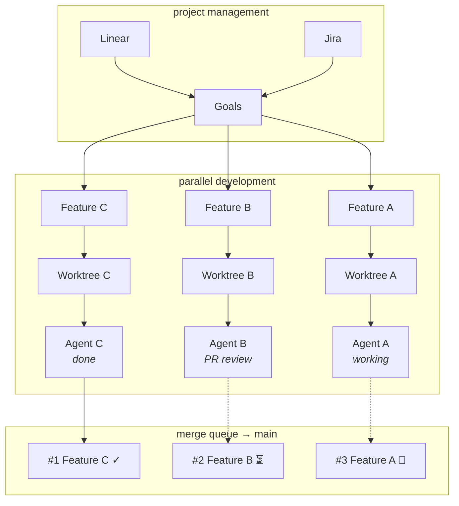

# athena

bloomberg terminal for engineering.

> [!WARNING]
> pre-1.0. active development. things will break.

one terminal. tickets, agents, worktrees, task lists. no context switching.

## the flow

```
idea → goal → feature → worktree → agent → tasks → PR
```

```bash
ath g new "Auth system"              # create a goal
ath f new wi-a3f8 "OAuth login"      # feature under that goal
ath spawn -f wi-a3f8.1               # worktree + agent + task list, one command
```

agent spins up in its own worktree. watch from another tab:

```bash
ath tree                             # see the whole hierarchy
ath tree wi-a3f8                     # zoom into one goal
ath wt                               # worktree status
```

## spawn

the core command. creates a worktree, sets up the task list, launches claude code.

```bash
ath spawn -f <feature-id>            # primary flow - worktree + agent
ath spawn -f <feature-id> --headless # fire-and-forget, runs in background
ath spawn                            # interactive claude in current dir
ath spawn ENG-123                    # ticket ID → goal → spawn
```

the agent gets your goal context, feature description, and available commands injected into its system prompt. its task list maps 1:1 to your feature work item.

## work items

```
Goal     □  Auth system               ← strategic objective
  Feature  ◇  OAuth login             ← worktree + agent + PR
    Task     ○  Add token refresh     ← claude code native task
    Task     ○  Write tests           ← claude code native task
  Feature  ◇  Session management
```

goals are strategic. features are PR-sized. tasks are claude code's own task list - you see exactly what the agent sees.

## quick reference

```bash
ath                    # status overview
ath g new "subject"    # create goal
ath f new <goal> "x"   # create feature under goal
ath spawn -f <feat>    # spawn agent on feature
ath tree               # full work item tree
ath wt                 # list worktrees
ath wt prune           # clean up merged worktrees
ath sp "idea"          # scratchpad note
ath plugin             # manage integrations
```

## architecture

multiple features run in parallel. each gets its own worktree and agent. the merge queue keeps them ordered.


```mermaid
graph TD
    subgraph pm ["project management"]
        Linear["Linear"] --> Goals
        Jira["Jira"] --> Goals
        Goals["Goals"]
    end

    Goals --> F1["Feature A"]
    Goals --> F2["Feature B"]
    Goals --> F3["Feature C"]

    subgraph parallel ["parallel development"]
        F1 --> W1["Worktree A"] --> A1["Agent A<br/><i>working</i>"]
        F2 --> W2["Worktree B"] --> A2["Agent B<br/><i>PR review</i>"]
        F3 --> W3["Worktree C"] --> A3["Agent C<br/><i>done</i>"]
    end

    subgraph queue ["merge queue → main"]
        Q1["#1 Feature C ✓"]
        Q2["#2 Feature B ⏳"]
        Q3["#3 Feature A 🔨"]
    end

    A3 --> Q1
    A2 -.-> Q2
    A1 -.-> Q3
```

see [docs/architecture.md](docs/architecture.md) for detailed diagrams: sequence flows, lifecycle states, data model, and system components.

data stays local. sqlite, not a vendor's session history.

## building

```bash
make install    # ath, athenad, athena-mcp
athenad &       # start daemon
```

requires go 1.24+.

## license

MIT
