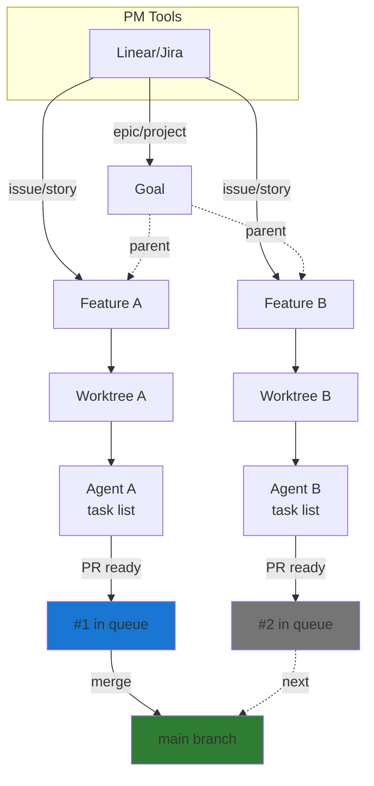

# athena

bloomberg terminal for engineering.

> [!WARNING]
> pre-1.0. active development. things will break.

one terminal. tickets, agents, worktrees, task lists. no context switching.

## how it works

```
ticket → goal → feature → worktree → agent → PR → merge queue → main
```


```mermaid
graph TD
    subgraph pm ["PM Tools"]
        Linear[Linear/Jira]
    end

    Linear -->|epic/project| G[Goal]
    Linear -->|issue/story| F1[Feature A]
    Linear -->|issue/story| F2[Feature B]

    G -.parent.-> F1
    G -.parent.-> F2

    F1 --> W1[Worktree A]
    F2 --> W2[Worktree B]

    W1 --> A1[Agent A<br/>task list]
    W2 --> A2[Agent B<br/>task list]

    A1 -->|PR ready| Q1[#1 in queue]
    A2 -->|PR ready| Q2[#2 in queue]

    Q1 -->|merge| Main[main branch]
    Q2 -.next.-> Main

    style Main fill:#2e7d32
    style Q1 fill:#1976d2
    style Q2 fill:#757575
```

## quick start

```bash
# install lifecycle hooks (automatic tracking)
ath enable

# import from PM tool
ath spawn ENG-123        # epic → goal + features
ath spawn ENG-456        # story → feature under parent

# or create manually
ath g new "Auth system"
ath f new wi-a3f8 "OAuth login"
ath spawn -f wi-a3f8.1   # worktree + agent + task list

# watch progress
ath tree                 # work item hierarchy
ath wt                   # worktree status
ath queue                # merge queue
```

## what you get

- **work items**: goals (strategic), features (PR-sized), tasks (claude code native)
- **parallel development**: one worktree per feature, isolated agents
- **merge queue**: features merge in order, new work branches from queue head
- **PM integration**: jira/linear → goals/features automatically
- **plugins**: github, gitlab, linear, jira

## core commands

```bash
ath enable               # install hooks (do this once per project)
ath spawn -f <feat>      # worktree + agent on feature
ath spawn ENG-123        # smart import from ticket ID
ath tree                 # see work hierarchy
ath wt                   # list worktrees
ath queue add            # add to merge queue
ath plugin               # manage integrations
```

see [docs/](docs/) for detailed architecture, development guide, and design docs.

## install

```bash
make install             # ath, athenad, athena-mcp
athenad &                # start daemon
```

requires go 1.24+.

## license

MIT
