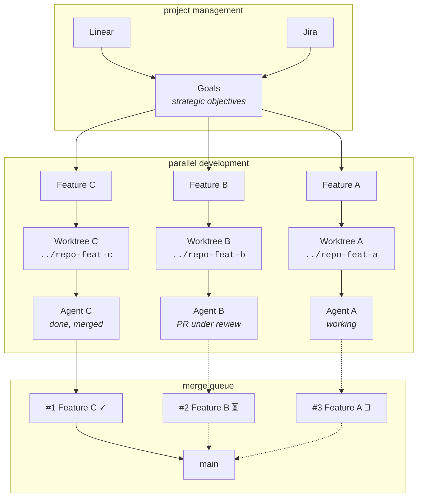
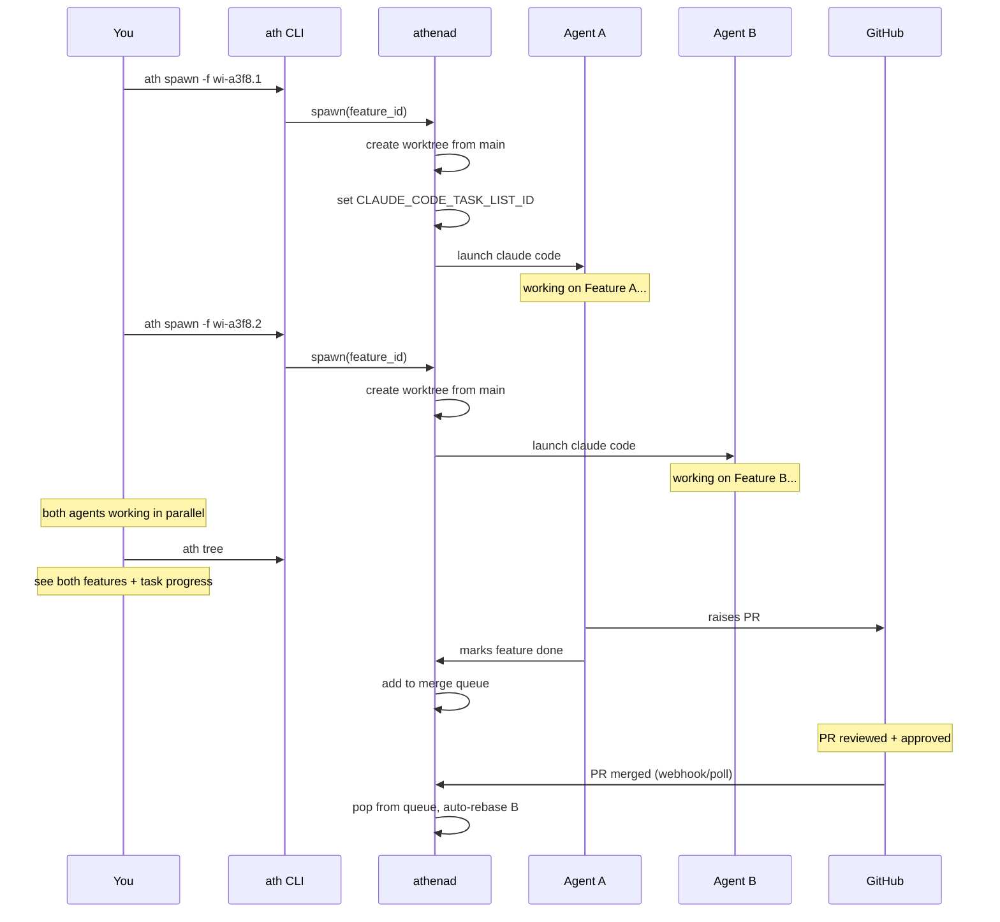
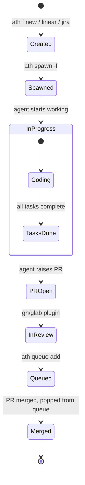
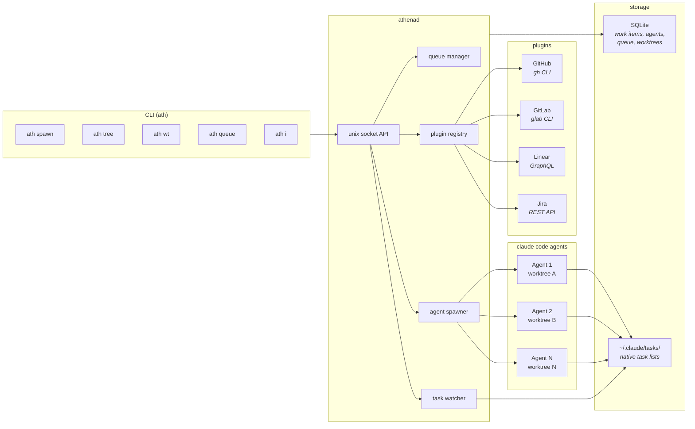
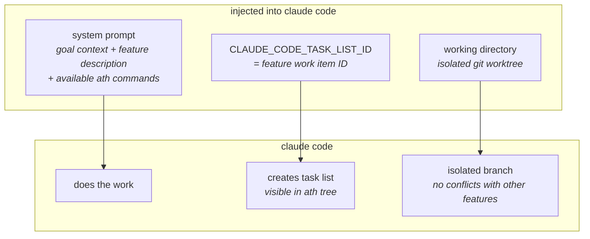
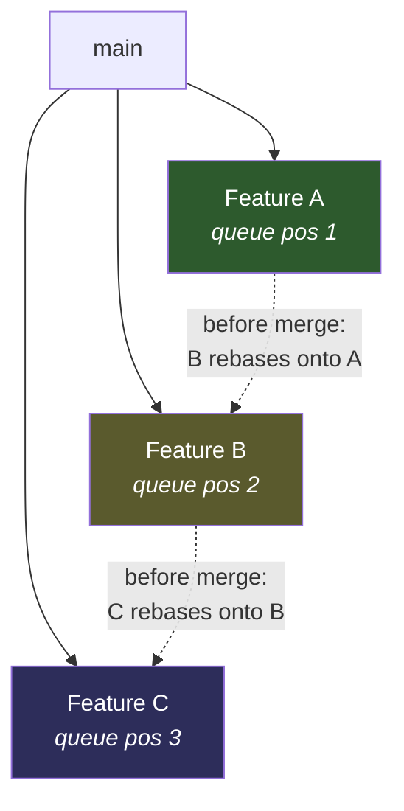
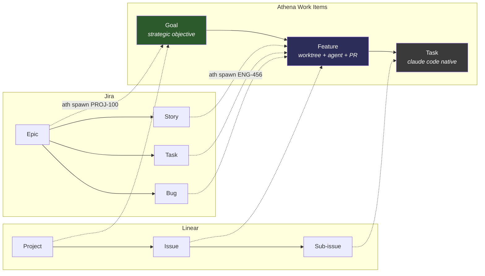
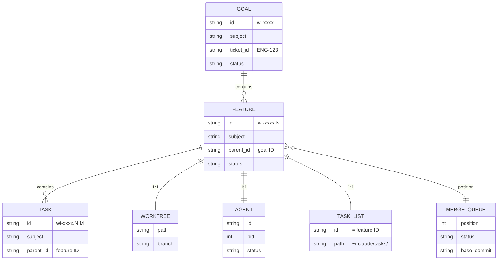

# architecture

## how it works

you work on multiple features at once. each feature gets its own worktree, its own agent, its own task list. the merge queue keeps them ordered so nothing conflicts.



The harness landscape is racing. New capabilities ship weekly. Athena's job is to:
- Abstract the common operations (spawn, resume, stream events)
- Expose harness-specific capabilities when they matter
- Let you switch harnesses per-task based on their strengths

### 3. Event Sourcing

All agent I/O is an append-only event log. Never mutate, only append. This gives us:
- Perfect audit trail (what happened, when, in what order)
- Easy replay (restart agent, replay events to restore context)
- Snapshots for efficiency (checkpoint + replay from there)
- Eventual consistency for replication (just replay missing events)

### 4. Context Efficiency and Sharing

**Context should be managed, pruned, and shared to reduce cost and overhead.**

Athena should curate context across agents and sessions: summaries, deduped facts,
and reusable artifacts (plans, decisions, code pointers). Share context between
related tasks or projects with explicit export/import so agents do not pay
repeatedly for the same ground truth.

Why this matters:
- **Lower spend**: Less repeated token spend for the same background.
- **Faster ramps**: Agents start with distilled context instead of re-learning.
- **Lower overhead**: Fewer manual recaps and less prompt rework.
- **Team leverage**: Share context safely across collaborators or environments.

### 5. Bloomberg-Style Ops Terminal

**Athena should be the command-and-control terminal for engineering.**

The interface should converge project management, CI/CD, agent activity,
scheduling, and context insights into one ops view, while integrations fan out
to Jira/Linear and other systems. Context intelligence (summaries, embeddings,
data signals) should surface inline with operational decisions.

Why this matters:
- **One console**: Fewer tool hops and less context switching.
- **Faster ops**: CI/CD, task queues, and agent status in one view.
- **Automated flow**: Create and update tickets directly from agent output.
- **Better decisions**: Context and embeddings turn history into insight.

---

## System Overview

```
┌─────────────────────────────────────────────────────────────┐
│                        CLI Layer                            │
│  cmd/ath/, cmd/athena-cli/                                  │
│  Spawn, queue, work items, plugin management                │
└─────────────────────────────────────────────────────────────┘
                            │ Unix socket RPC
                            ▼
┌─────────────────────────────────────────────────────────────┐
│                      Daemon Layer                           │
│  internal/daemon/, internal/control/                        │
│  ├── Daemon (lifecycle, handlers, workers)                  │
│  ├── Spawn flow (feature/ticket/work-item modes)            │
│  ├── Merge queue graph + queue sync                         │
│  └── Job execution + task watcher                           │
└─────────────────────────────────────────────────────────────┘
                            │
                            ▼
┌─────────────────────────────────────────────────────────────┐
│                     Execution Layer                         │
│  internal/agent/, internal/runner/                          │
│  ├── Spawner (Claude Code subprocess lifecycle)             │
│  ├── Runner abstraction                                     │
│  └── Archetype-based launch options                         │
└─────────────────────────────────────────────────────────────┘
                            │
                            ▼
┌─────────────────────────────────────────────────────────────┐
│                  Integrations & Context                     │
│  internal/plugin/, internal/task/, internal/context/        │
│  ├── VCS plugins (GitHub/GitLab)                            │
│  ├── PM plugins (Linear/Jira)                               │
│  ├── Task provider registry (Claude task lists)             │
│  └── Shared context/state services                          │
└─────────────────────────────────────────────────────────────┘
                            │
                            ▼
┌─────────────────────────────────────────────────────────────┐
│                     Storage Layer                           │
│  internal/store/, internal/eventlog/                        │
│  SQLite (local source of truth)                             │
└─────────────────────────────────────────────────────────────┘
```

## the parallel workflow

the key idea: you're never blocked. while one feature is under PR review, another agent is coding, and a third just merged. the queue handles ordering.



## feature lifecycle

every feature follows this path. athena manages each step.



## system components



## what the agent gets

when you run `ath spawn -f <feature>`, the agent launches with:



## merge queue detail

the queue solves the "multiple features in flight" problem. all features branch from main for parallel development, then rebase onto each other during merge for clean integration.



**Development**: All features work in parallel, branching from main
**Integration**: Queue order determines merge sequence with automatic rebasing

when you edit an earlier feature and run `ath queue bump`, dependents are automatically reconciled.

## pm integration

athena maps external PM hierarchies into its work item model. ticket type is detected automatically on spawn.



spawning an epic creates the goal and a feature for each child story. spawning a story creates a feature and auto-links the parent epic as a goal.

## data model


